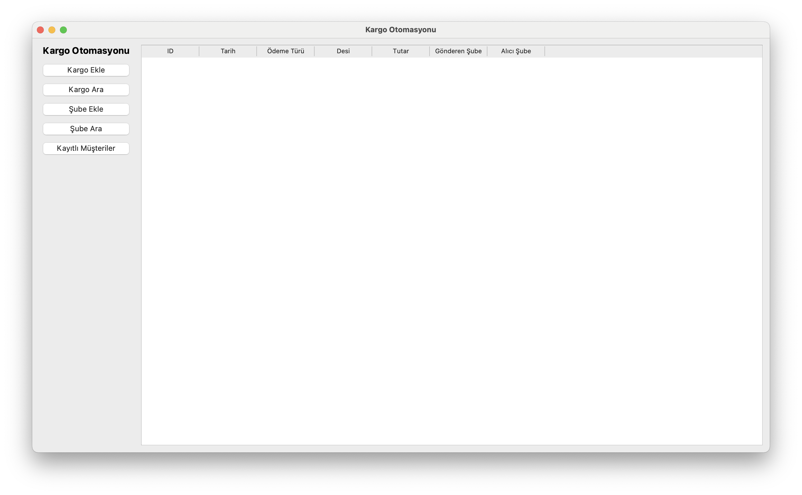
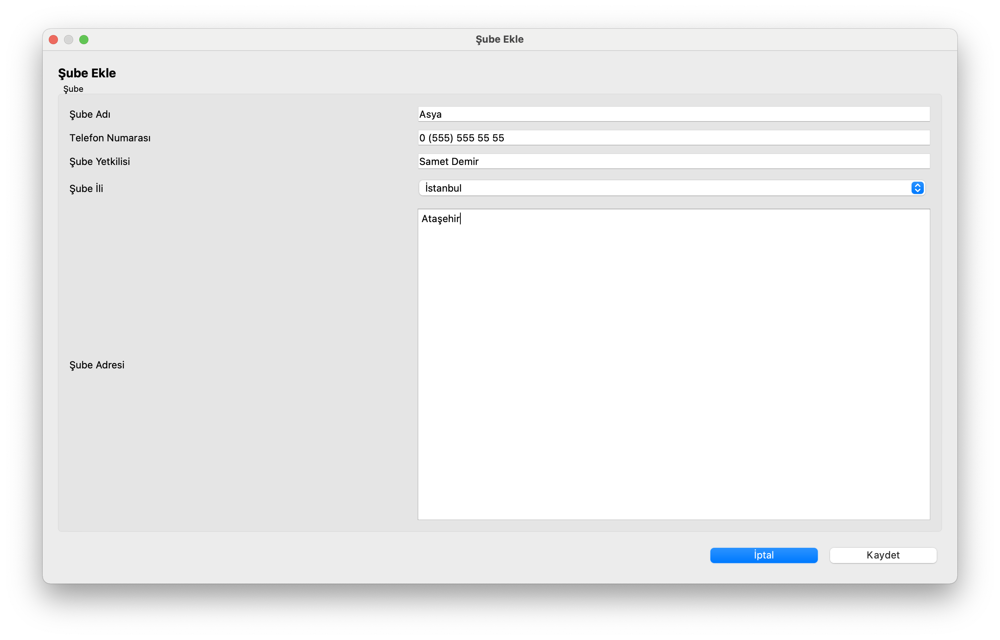
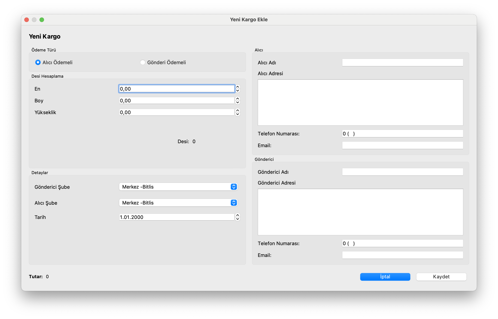
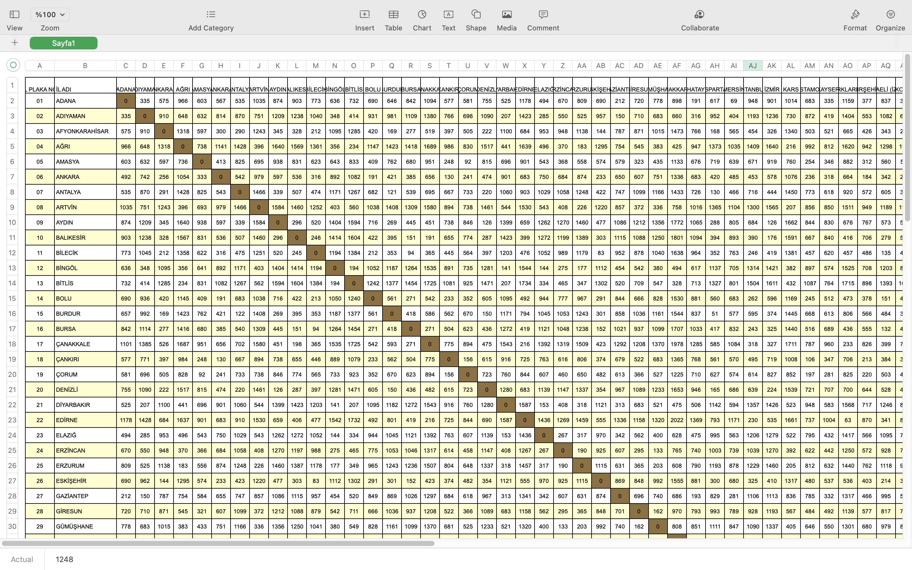

# Kargo Otomasyonu

Hızlı erişim:
- [Detaylar](#Detaylar)
    - [Projenin Kapsamı](#Projenin-Kapsamı)
    - [Yapılacaklar Listemiz](#Yapılacaklar-Listemiz)
        - Check-List
    - [Bilinen Sorunlar](#Bilinen-Sorunlar)
    - [Şube Ekleme](#Şube-Ekleme)
    - [Kargo Ekleme](#Kargo-Ekleme)
    - [Kargo Tutarlarların Hesaplanması](#Kargo-Tutarlarların-Hesaplanması)
- [Yazılımı geliştirirken kullandığımız araçlar ve diller](#Yazılımı-geliştirirken-kullandığımız-araçlar-ve-diller)
- [Teşekkürler](#Teşekkürler)

---

## Detaylar

### Projenin Kapsamı
Karadeniz Teknik Üniversitesi İstatistik ve Bilgisayar Bilimleri 2. Sınıf ikinci dönem Nesne Yönelimli Programlama dersi vize projesi.

2021 yılı 2. sınıf Bahar Dönemi N.Y.P. dersinde hocamız **Tolga Berber** C++ dilini ve Qt kütüphanesinin araçlarını kullanarak yapabileceğimiz 3 adet proje belirledi.

- **Belediye Taşımacılığı Yönetimi**: Bu yazılımda bir belediyeye ait toplu taşıma sisteminin yönetilmesi istenmektedir.

- **Teknoloji Marketi Otomasyonu**: Bu projede, bir teknoloji marketine ait ürünlerin yönetilmesi istenmektedir.

- **Kargo Firma Otomasyonu**: Bir kargo firmasına ait gönderilerin yönetimini sağlayan bir yazılım
geliştirmemiz beklenmektedir.

Bu projelerden bir tanesini en az 2 kişi, en fazla 3 kişilik gruplar halinde yapılmasını zorunlu tuttu. Biz 3 arkadaş olarak Kargo firma otomasyonu projesini yapmaya karar verdik.

### Yapılacaklar Listemiz

**Hedef**

Yazılımın aşağıdaki yetenekleri sağlamalıdır!

1. Gönderiler sisteme kaydedilebilmelidir.

    - Her gönderinin desi türünden hesabı yapılabilmelidir Gönderi fiyatı desi üzerinden yapılacaktır.

        - Desi hesabı ağırlık veya hacim ile hesaplanabilir

            - Normalde sadece hacim ile hesaplanır fakat firma ağırlık ile hesaplama mekanizması da istemektedir.

    - Gönderilerin ödemesine göre 2 farklı tür olabilir!

        - Gönderici Ödemeli

        - Alıcı Ödemeli

2. Firma Hizmet verdiği illeri (şubelerini) ve aralarındaki mesafeleri yazılıma girebilmelidir.

3. Firma gönderdiği adresleri kaydetmek istemektedir. Bu sebeple, gönderici veya alıcı adına göre gönderi esnasında kayıt yapılabilmelidir.

**Bonus**: Gönderilerin geliş sıralarına göre gönderilmeleri. (Yukarıdaki adımlar tamamlandıktan sonra değerlendirmeye
tabidir.)

#### Check-List

- [x] Gönderiler sisteme kaydedilebilmelidir.

- [x] Her gönderinin desi türünden hesabı yapılabilmelidir Gönderi fiyatı desi üzerinden yapılacaktır.

- [x] Desi hesabı hacim üzerinden yapılabiliyor.

- [ ] Normalde sadece hacim ile hesaplanır fakat firma ağırlık ile hesaplama mekanizması da istemektedir.

- [x] Gönderilerin ödemesine göre 2 farklı tür olabilir! (Alici Ödemeli , Gönderici Ödemeli)

- [x] Firma Hizmet verdiği illeri (şubelerini) girebilmelidir.

- [x] Firma Hizmet verdiği illerin mesafelerini yazılıma girebilmelidir. **Karayolları Genel Müdürlüğündeki iller arasındaki mesafe veritabanı kullanıldı.** 

- [x] Firma gönderdiği adresleri kaydetmek istemektedir. Bu sebeple, gönderici veya alıcı adına göre gönderi esnasında kayıt yapılabilmelidir.

### Bilinen Sorunlar

**Kritik:**
- ~~Program ilk çalıştığında eğer şube eklenmediyse Kargo ekle ekranı çöküyor.~~ Çok fazla test edemedik.
- Bazen anlamsız şekilde çöküyor.

**Normal**
- Kargo Ekle ekranındaki sinyal slot bağlantısı olan Label'lar ilk açıldığında rastgele sayılar üretiyor. 

### Şube Ekleme

Tutarın hesaplanması için ilk olarak şubelerin eklenmesi gerektir. Kargo tutarların hesaplanması oluşturduğumuz tablo için [tıklayın](#Kargo-Tutarlarların-Hesaplanması).

Bu ekran da şube adı, telefon numarası, yetkiki kişi ve şube ekranını kaydediyoruz. 

Bu ekranda KGM'den çektiğimiz iller arası uzaklık tablosunu kullanmak için Şube illerini önceden tanımladık. Tutarı hesaplamak ilin seçilmesi gerekmektedir.

### Kargo Ekleme

Şubenin yeni kargo kaydetmesini sağlar. Bu ekranda Desi Hesaplama, Şube seçimi ve müşteri detayları bulanmaktadır. Bu bilgileri sisteme kaydetmektedir.

### Kargo Tutarlarların Hesaplanması

Elimizde 24x30x26 ebatlarında bir kolimiz olduğunu düşünelim. Kargo tutarını hesaplamak için önce desiyi hesaplamamız gereklidir. 

`Desi = En x Boy x Yükseklik / 3000`

formülünden  yararlanarak desi hesaplanır. Örneğimizdeki kolinin desisi **6.24** gelmekte. 

İllerin uzaklıklarını aşağıdaki excel dosaysından almaktayız.

Uzaklıkları işem kolaylığı açısından 3 ayırdık.

| Aralık (Km) | Çarpan |
|-------------|--------|
|   0-300     |    5   |
| 300-600     |    7   |
| 600-        |    10  |

Örneğin;

|                     | Km   | Çarpan | Desi | Tutar (TL) |
|---------------------|------|--------|------|--------|
|Adıyaman - Gaziantep | 150  |    5   | 6.24 |  31,20 |
|Aksaray - Adıyaman   | 580  |    7   | 6.24 |  43,68 |
|Çorum - İstanbul     | 614  |    10  | 6.24 |  62,40 |
|Trabzon - İstanbul   | 1248 |    10  | 6.24 |  62,40 |

KGM iller arası uzaklaklık için [tıklayın](https://www.kgm.gov.tr/Sayfalar/KGM/SiteTr/Root/Uzakliklar.aspx).

İndirdiğimiz excel dosyasını numbers üzerinden düzenledik. Ve Python ile uygun hale getirdik. 

Python kodları için [tıklayın](doc/doc-ipynb).

---

## Yazılımı geliştirirken kullandığımız araçlar ve diller

- C++

- Qt

- Git

---
  
## Yazılımı geliştiren kişiler

- Gülnur Ögür 395237 / [GitHub](https://github.com/gulnurogur "Gülnur Ögür Github Profili"), [Linkedin](https://www.linkedin.com/in/gülnur-ögür/)
- Hüseyin Mutlu 395273 / [GitHub](https://github.com/huseyin5 "Hüseyin Mutlu Github Profili"), [Linkedin](https://www.linkedin.com/in/huseyin-mutlu-a23a88164/)
- Ali Eren Ekinci 395262 / [GitHub](https://github.com/alierenekinci "Ali Eren Ekinci Github Profili"), [Linkedin](https://www.linkedin.com/in/alierenekinci/)

## Teşekkürler
- Dr.Öğr.Üyesi TOLGA BERBER - Karadeniz Teknik Üniversitesi Fen Fakültesi İstatistik ve Bilgisayar Bilimleri Bölümü /[Avesis](https://avesis.ktu.edu.tr/tberber), [Linkedin](https://www.linkedin.com/in/tolga-berber-606b2218/)
- Ozan Hanedan / [GitHub](https://github.com/ohanedan), [Linkedin](https://www.linkedin.com/in/ozanhanedan/)
- Oğuzhan İnan / [Github](https://github.com/oguzhaninan), [Linkedin](https://www.linkedin.com/in/oguzhaninan/?originalSubdomain=tr)
- Ahmet Çağatay / [GitHub](https://github.com/ahmetcagatay), [Linkedin](https://www.linkedin.com/in/ahmet-çağatay-61b2281aa/)
- Deniz Nazari / [GitHub](https://github.com/DenizNazari)
- Mahmud Ferzeli / [Github](https://github.com/mahmudfrzl), [Linkedin](https://www.linkedin.com/in/mahmud-ferzeli-4078b020b/)
